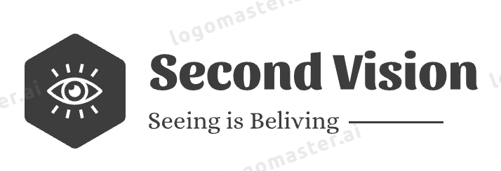

# Eye Tracking AI with Detectron2 and YOLOv5

## 📖 Introduction

이 프로젝트는 Detectron2와 YOLOv5를 활용하여 눈의 움직임을 추적하는 인공지능 모델을 구현합니다. 머신 러닝 및 컴퓨터 비전 기술을 결합하여 정확한 눈 움직임 추적 기능을 제공합니다.

## 📦 Data

아래의 링크를 통해 우리가 사용한 데이터 세트를 확인할 수 있습니다:

- [Download our data here](https://www.aihub.or.kr/aihubdata/data/view.do?currMenu=&topMenu=&aihubDataSe=realm&dataSetSn=548)

## 🚀 Getting Started

- [How to Downoload Detectron2 on M1](https://velog.io/@huttzza/m1-detectron2-%EC%84%A4%EC%B9%98)
<pre>
 pip install -r requirements.txt
</pre>

| Library | Version |
|---------|-------------|
| `pyhton` | 3.8 |
| `detectron2` | 0.6 |
| `torch` | 1.12.1 |
| `Pillow` | 9.4.0 |

## 🤝 Contributing

프로젝트에 기여하기 위한 이슈 및 풀 리퀘스트를 환영합니다.

---

🙌 감사합니다! 프로젝트에 관한 질문이나 피드백이 있다면, 언제든지 연락주세요!
